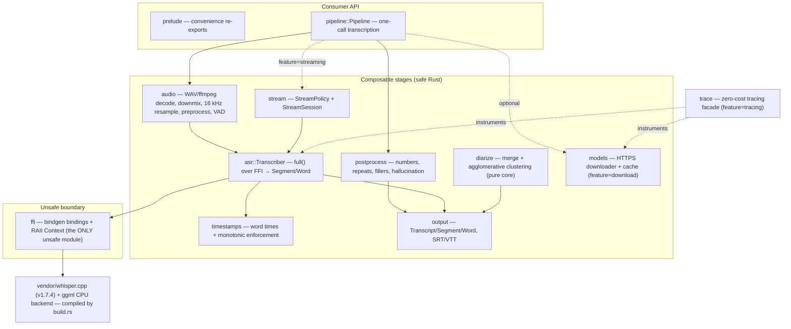
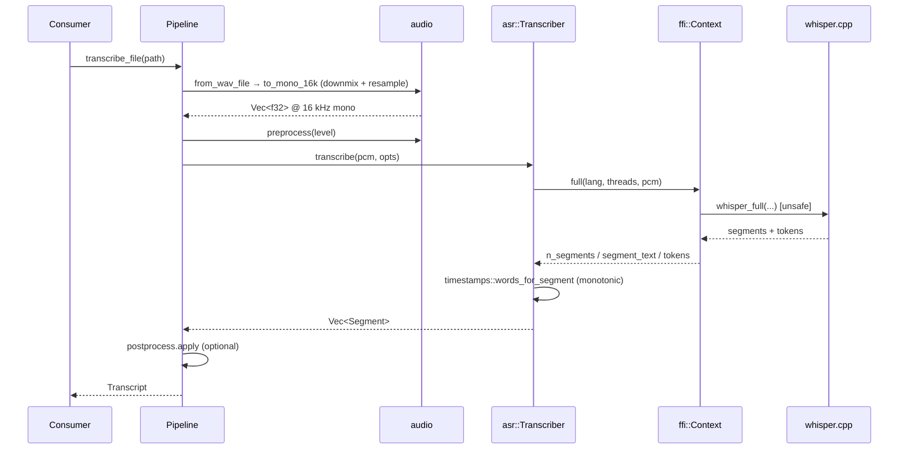

# Architecture — whisper-rs
<!-- rev:001 -->

`whisper-rs` is a **layered, safe-by-construction** wrapper over whisper.cpp. Each layer is a small,
focused module; the high-level `Pipeline` is a thin composition of the lower stages, not a place for
its own logic. `unsafe` is confined to a single module (`src/ffi/`) — see
[ADR-0001](adr/0001-unsafe-confined-to-ffi.md).

## Layer overview

## Request flow — `Pipeline::transcribe_file`

## Key invariants

- **`unsafe` only in `src/ffi/`** ([ADR-0001](adr/0001-unsafe-confined-to-ffi.md)). Every other module
  is safe Rust; `ffi::Context` is the RAII owner of the whisper.cpp state pointer.
- **One crate-wide error type**, `WhisperError` → `Result<T>`
  ([ADR-0002](adr/0002-single-error-type.md)). It is `#[non_exhaustive]`.
- **Optional capabilities are Cargo features**, off-by-default where they add native deps
  ([ADR-0003](adr/0003-feature-gated-optional-capabilities.md)): `download`, `diarization`,
  `streaming` (on by default), `ffmpeg`, `raw-api`, `tracing` (opt-in).
- **`Transcriber` is `Send` but not `Sync`** — whisper.cpp state is single-threaded; use one per thread.

## Build

`build.rs` compiles `vendor/whisper.cpp` (pinned v1.7.4 — core + ggml CPU backend) via `cc`: the `.c`
sources compile as C (with `_GNU_SOURCE` for glibc affinity symbols on non-MSVC), the `.cpp` sources as
C++17, folded into one static archive. It then runs `bindgen` over `wrapper.h` to generate
`OUT_DIR/bindings.rs`, consumed only by `src/ffi/`.
